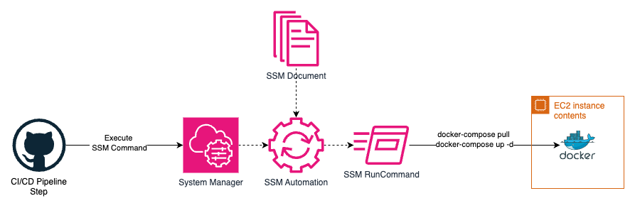

# AWS SSM Docker Compose Deploy Module

Terraform module that creates SSM Automation RunBook to execute application deployment via Docker Compose commands.



Run docker-compose command on EC2 instances, with provided environment variables via SSM Command. 
```shell
docker-compose pull
docker-compose up -d
```


## Features

- 🚀 Remote deployment via SSM automation
- 📧 SNS success/failure notifications  
- 🔧 Configurable environment variables

## Prerequisites

- Terraform >= 1.5.7
- EC2 instances with SSM Agent, Docker, and Docker Compose installed

## Usage

```hcl
module "docker_compose_deploy" {
  source = "github.com/Mich0232/ssm-docker-compose-deploy.git"

  resource_prefix = "my-app-prod"
  
  docker_compose_env_variables = {
    VERSION = {
      description = "Application version to deploy"
      default     = "latest"
    }
    DATABASE_URL = {
      description = "Database connection string"
    }
  }

  tags = {
    Environment = "production"
    Project     = "my-app"
  }
}
```

See [examples/simple_usage](./examples/simple_usage/) for a complete working example.

## Deploying Applications

```bash
# Deploy using the created SSM document
aws ssm start-automation-execution \
  --document-name "DockerComposeDeploy" \
  --parameters \
    "TargetInstanceId=i-1234567890abcdef0" \
    "VERSION=v1.2.3"
```

## Input Variables

| Name | Description | Type | Default | Required |
|------|-------------|------|---------|:--------:|
| `resource_prefix` | Terraform resource prefix. Setting this to 'app-staging' will create resources named 'app-staging-iam-role' | `string` | `""` | no |
| `tags` | Map of default tags to include in every resource created | `map(string)` | `{}` | no |
| `default_iam_policy_name` | Name of AWS managed policy to attach | `string` | `"AmazonSSMAutomationRole"` | no |
| `docker_compose_env_variables` | Environment variables to pass to docker-compose | `map(object({description = string, default = optional(string)}))` | `{}` | no |
| `sns_success_message_subject` | AWS SNS success notification message subject | `string` | `"🚀 Deployment Success"` | no |
| `sns_success_message_text` | AWS SNS success notification message text | `string` | See default message | no |
| `sns_failure_message_subject` | AWS SNS failure notification message subject | `string` | `"❌ Deployment Failure"` | no |
| `sns_failure_message_text` | AWS SNS failure notification message text | `string` | See default message | no |

## Outputs

| Name | Description |
|------|-------------|
| `ssm_document_config_name` | Name of the SSM document for environment configuration |
| `ssm_document_deploy_name` | Name of the SSM document for deployment automation |
| `sns_topic_arn` | ARN of the SNS topic for deployment notifications |
| `iam_role_arn` | ARN of the IAM role used by SSM automation |
| `iam_role_name` | Name of the IAM role used by SSM automation |

## SSM Document Parameters

| Parameter | Description | Type | Default | Required |
|-----------|-------------|------|---------|:--------:|
| `TargetInstanceId` | The ID of the EC2 instance to deploy to | String | - | Yes |
| `ComposeFilePath` | The absolute path to the docker-compose.yml file on the instance | String | `docker-compose.yml` | No |
| `WorkingDirectory` | Path where the command should run | String | `/home/ec2-user` | No |
| `EnvFileName` | The name of the configuration file to create | String | `ssm-dc-deploy.env` | No |
| *Custom Variables* | Any variables defined in `docker_compose_env_variables` | String | - | Depends on configuration |

## Architecture

```
┌─────────────────┐    ┌─────────────────┐    ┌─────────────────┐
│   Terraform     │    │   AWS SSM       │    │   EC2 Instance  │
│   Module        │───▶│   Documents     │───▶│   Docker        │
│                 │    │                 │    │   Compose       │
└─────────────────┘    └─────────────────┘    └─────────────────┘
                                │
                                ▼
                       ┌─────────────────┐
                       │   SNS Topic     │
                       │   Notifications │
                       └─────────────────┘
```
